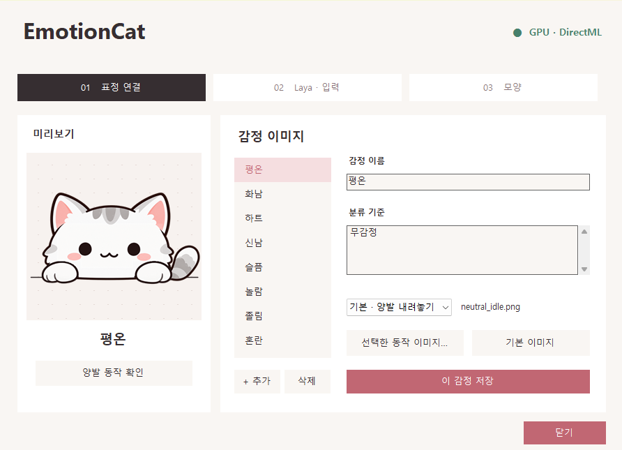

# EmotionCat 1.0.0

키보드를 치면 발이 움직이고, 입력한 글의 감정에 따라 표정이 바뀌는 데스크톱 고양이입니다.

## 사용법

1. [다운로드](https://github.com/kmu9842/EmotionCat/releases/latest)에서 OS에 맞는 ZIP을 받아 압축을 풉니다.
2. Windows는 `EmotionCat.exe`, macOS는 `EmotionCat.app`을 실행합니다.
3. 고양이 우클릭 → **EmotionCat 설정**, 또는 트레이 아이콘 더블클릭으로 설정을 엽니다.
4. **Laya · 입력**에서 감정 인식을 켜고 문장을 테스트합니다. **모양**에서 크기와 위치를 조절합니다.

Windows 감정 분석에는 DirectX 12 지원 GPU가 필요합니다. GPU를 사용할 수 없으면 경고 후 감정 분석이 꺼집니다. Python은 따로 설치하지 않아도 됩니다.

## 이미지 교체

1. **표정 연결**에서 바꿀 감정을 선택합니다.
2. 동작 목록에서 **기본 / 왼발 / 오른발 / 양발** 중 하나를 고릅니다.
3. **선택한 동작 이미지…**를 눌러 원하는 이미지를 선택합니다. 이미지는 바로 저장됩니다.
4. 감정 이름이나 분류 기준도 바꿨다면 **이 감정 저장**을 누릅니다.

투명 배경 PNG를 사용하면 깔끔하게 표시됩니다. **기본 이미지**로 되돌리거나 **양발 동작 확인**으로 움직임을 확인할 수 있습니다.
